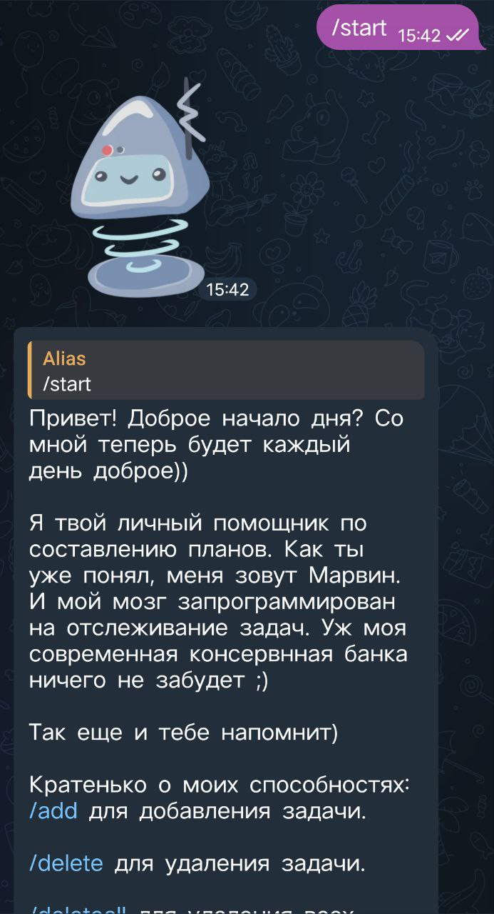
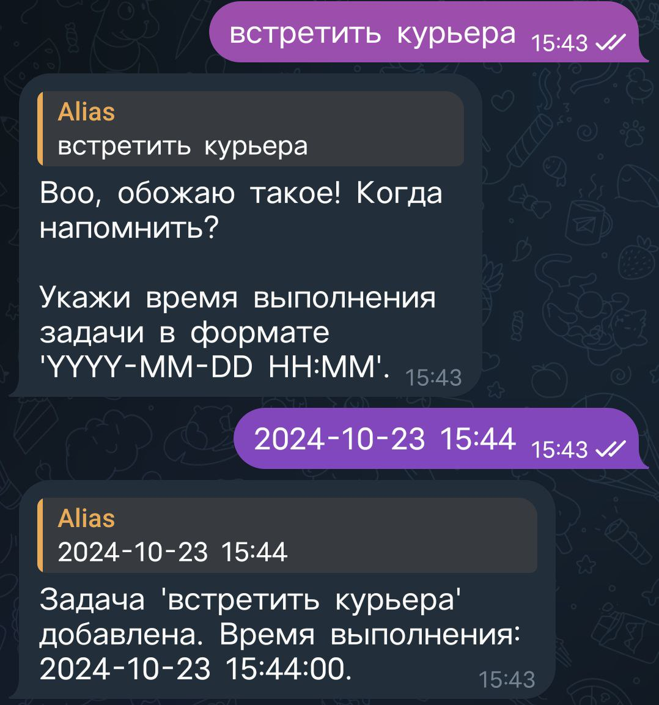
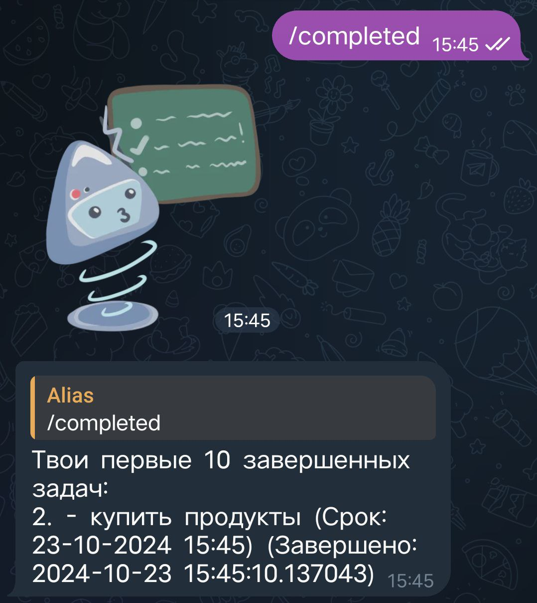
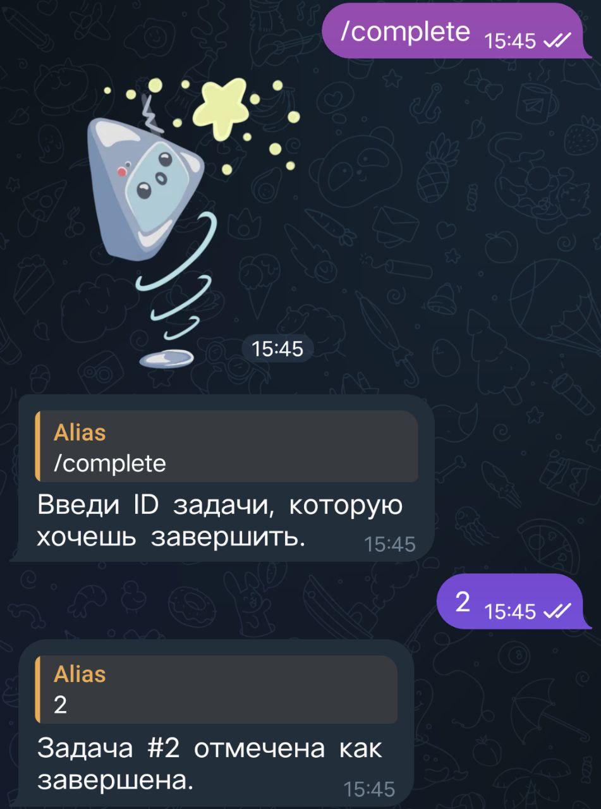
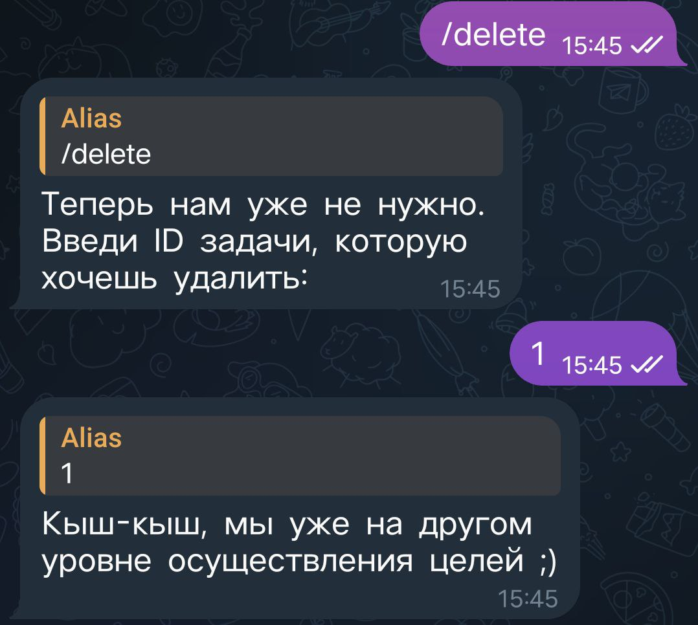
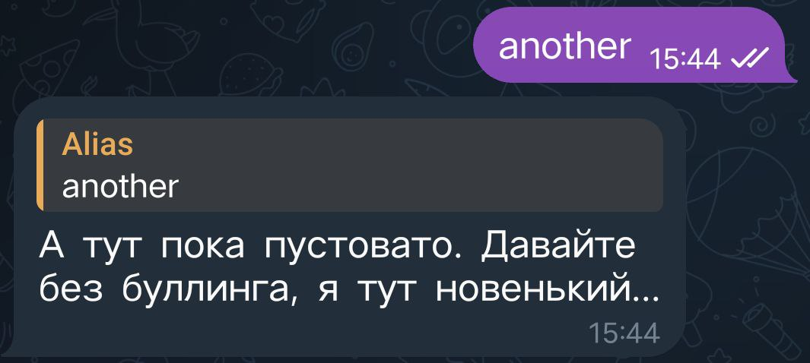

# Телеграм бот планировщик задач Марвин

## Описание

Данный бот для управления задачами разработан на асинхронной библиотеке `aiogram`. Он предназначен для создания, отслеживания и напоминания о задачах пользователей. Бот позволяет отправлять команды для добавления новых задач, изменения статусов и получения информации о предстоящих задачах. После отправки команды `/start` бот выводит список доступных команд, которые можно использовать для работы. Пользователь может добавлять задачи в формате "Сделать что-то" и задавать срок выполнения, например, "Сделать отчет", после появится запрос на ввод времени для напоминания, его нужно вводить в формате "2024-03-12 15:00". Бот сохранит данные в базу данных `SQLite` и запланирует напоминание через `asyncio` и `aiosqlite` в указанное время. Использование библиотек небходимо для проверки и отправки уведомлений о задачах пользователям бота.

### Зависимости
***Загрузка зависимостей через pip install -r requirements.txt.***

>Основные зависимости:
- aiogram = "2.25.1"
- aiosqlite = "0.20.0"
- asyncio = "3.4.3"
- pyTelegramBotAPI = "4.23.0"

## Взаимодействие с ботом. Команды.

- После отправки команды `/start`, бот выводит приветственное сообщение со списком доступных команд:

- Для того, чтобы начать работу с ботом необходимо ввести свой часовой пояс. Это необходимо, чтобы бот смог отправить напоминание о задаче:

- После можно сразу добавить новую задачу. Необходимо отправить сообщение с названием задачи. После бот запросит дату и время в формате `"год-месяц-день час:минута"`. Бот сохраняет задачу в базу данных SQLite и планирует напоминание через asyncio и aiosqlite в заданное время:

- Для добавления задачи необходимо отправить команду/нажать на кнопку  `/add`:

- Для просмотра списка всех актуальных задач необходимо отправить команду/нажать на кнопку `/list`:

- Для просмотра списка активных задач необходимо отправить команду/нажать на кнопку `/active`:

- Для просмотра списка завершенных задач необходимо отправить команду/нажать на кнопку `/completed`:

- Для завершения задачи по ее идентификатору необходимо отправить команду/нажать на кнопку `/complete`:

- Для удаления задачи по ее идентификатору необходимо отправить команду/нажать на кнопку `/delete`:

- Для удаления всех задач необходимо отправить команду/нажать на кнопку `/deleteall`:

- Для просмотра других функций необходимо нажать на кнопку `another`. Она существует для того, чтобы в дальнейшем можно было развивать бот и добавлять новые функции:

- Для запуска функций можно использовать как команды из списка, так и кнопки из клавиатуры:

## Запуск.
Точка входа - модуль `main.py`. Для запуска бота необходимо запустить `main.py`. Для корректной работы бота необходмо загрузить зависимости через pip install -r requirements.txt.